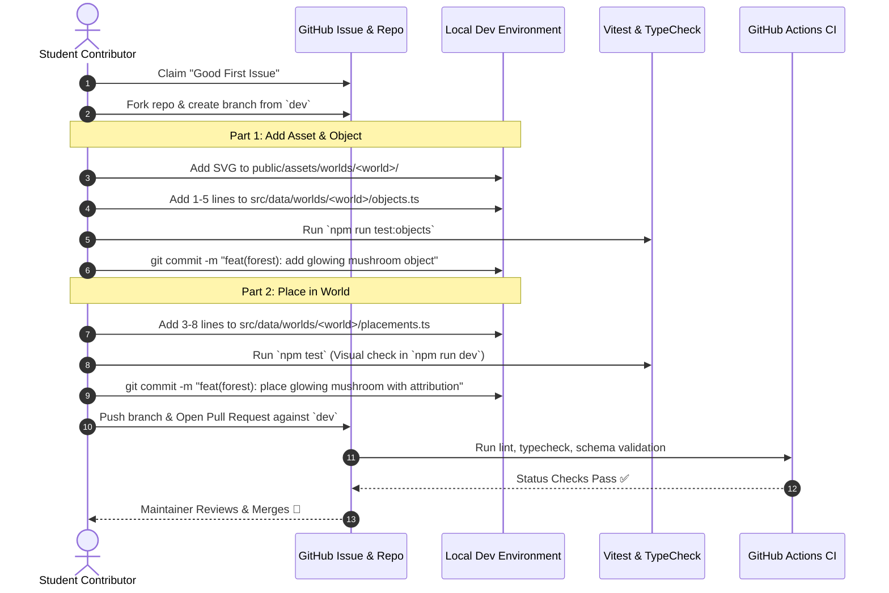

# Contribution Lifecycle & Workflow

## 1. The Two-Commit Workflow Model

To teach clean Git hygiene and separation of concerns, every world contribution follows an intentional **2-commit pattern**:



---

## 2. Step-by-Step Breakdown

### Step 1: Issue Claiming & Branch Setup
1. Find an issue labeled `good first issue` or `world-contribution` on GitHub.
2. Comment to claim the issue.
3. Fork the repository and clone your fork locally.
4. Create your branch branching off `dev`:
   ```bash
   git checkout -b contrib/forest-glowing-mushroom origin/dev
   ```

---

### Step 2: First Commit — Asset & Object Registration (~1–5 lines)
1. Place your paper-style SVG or PNG file into:
   `public/assets/worlds/<world-name>/<object-id>.svg`
2. Open `src/data/worlds/<world-name>/objects.ts` and add your object entry:
   ```typescript
   "glowing-mushroom": {
     id: "glowing-mushroom",
     name: "Glowing Mushroom",
     category: "flora",
     assetPath: "/assets/worlds/growing-forest/glowing-mushroom.svg",
     defaultWidthPercent: 3.5,
   },
   ```
3. Run the object test suite:
   ```bash
   npm run test:objects
   ```
4. Commit Part 1:
   ```bash
   git add public/assets/worlds/ src/data/worlds/
   git commit -m "feat(forest): add glowing mushroom object"
   ```

---

### Step 3: Second Commit — World Placement & Attribution (~3–8 lines)
1. Open `src/data/worlds/<world-name>/placements.ts`.
2. Add your placement at an unoccupied coordinate:
   ```typescript
   {
     id: "placement-glowing-mushroom-01",
     objectId: "glowing-mushroom",
     x: 42.5,
     y: 78.2,
     layer: "midground",
     contributor: {
       username: "your-github-username",
       avatarUrl: "https://github.com/your-github-username.png",
     },
   },
   ```
3. Run the local dev server and full test suite:
   ```bash
   npm run dev
   npm test
   ```
4. Commit Part 2:
   ```bash
   git add src/data/worlds/
   git commit -m "feat(forest): place glowing mushroom with attribution"
   ```

---

### Step 4: Pull Request & Automated Verification
1. Push branch to your fork:
   ```bash
   git push origin contrib/forest-glowing-mushroom
   ```
2. Open a Pull Request against the `dev` branch using the PR template.
3. GitHub Actions verifies:
   - TypeScript compilation (`npm run typecheck`)
   - Schema validation (`npm run test:unit`)
   - Asset path verification (checks files exist)
   - Code formatting (`npm run lint`)
4. Once merged, the issue is closed or recycled for next iterations.
