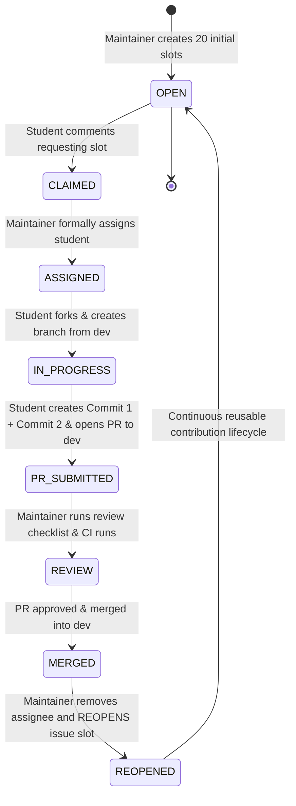

# Contribution Lifecycle & Reusable Issue Pool Architecture

## 1. The Reusable Contribution Slot Architecture

To support 200–300 student contributors without creating hundreds of one-time issues or cluttering the issue tracker, **Growing Worlds maintains a pool of approximately 20 active contribution slots**.

An issue represents an **active contribution slot in a specific world segment**, not a single one-off task. When a student completes a contribution, the PR is merged into `dev`, and the maintainer **reopens the issue slot** for the next student to add another item to that world segment.



### Key Lifecycle States Defined:
1. **OPEN**: The slot is unassigned and available for any student to claim.
2. **CLAIMED**: A student has commented requesting the issue.
3. **ASSIGNED**: A maintainer has formally assigned the GitHub issue to the student. (Held for 48 hours).
4. **IN PROGRESS**: The student has branched from `dev` and is creating their 2 commits.
5. **PR SUBMITTED**: Contributor opened a PR targeting the `dev` branch with 2 distinct commits.
6. **MERGED**: Maintainer merged the PR into `dev`. All previous world items remain untouched.
7. **REOPENED**: Maintainer unassigns the contributor and reopens the issue for the next contributor.

---

## 2. Documented 20-Issue Slot Distribution

| Slot # | Target World | Target Segment | Current Status | Allowed Categories / Negative Space Guidance |
| :--- | :--- | :--- | :--- | :--- |
| **#01** | Growing Forest | `forest-01` | **Active** | Woodland flora, mushrooms, ground stones |
| **#02** | Growing Forest | `forest-01` | **Active** | Flying fauna, owls, canopy foliage, birds |
| **#03** | Growing Forest | `forest-02` | **Active** | Meadow flowers, grass clumps, small critters |
| **#04** | Growing Forest | `forest-02` | **Active** | Forest path details, rocks, sunlit trees |
| **#05** | Growing Forest | `forest-03` | **Active** | Deep moss terraces, fallen logs, woodland shrubs |
| **#06** | Growing Universe | `universe-01` | **Active** | Spiral galaxies, nebulae, stardust constellations |
| **#07** | Growing Universe | `universe-02` | **Active** | Orbiting satellites, comets, asteroid clusters |
| **#08** | Growing Ocean | `ocean-01` | **Active** | Coral formations, sea anemones, seashells |
| **#09** | Growing Ocean | `ocean-02` | **Active** | Swimming fish, sea turtles, jellyfish, kelp |
| **#10** | Growing City | `city-01` | **Active** | Street lamps, bicycles, park benches, mailboxes |
| **#11** | Growing City | `city-02` | **Active** | Transit props, street trees, civic storefront objects |
| **#12** | Growing Island | `island-01` | **Active** | Coconut palms, sea shells, wooden canoes, tropical flowers |
| **#13** | Growing Island | `island-02` | **Active** | Tropical parrots, volcanic rocks, lagoon fauna |
| **#14** | Growing Farm | `farm-01` | **Active** | Scarecrows, harvest pumpkins, watering cans, garden tools |
| **#15** | Growing Farm | `farm-02` | **Active** | Golden wheat bundles, pasture animals, wooden fences |
| **#16** | Growing Campus | `campus-01` | *Template* | Brick dorms, library books, campus benches |
| **#17** | Fantasy World | `fantasy-01` | *Template* | Floating crystal islands, rune spires, wizard towers |
| **#18** | Growing Village | `village-01` | **Active** | Thatched cottages, wooden carts, market baskets, lanterns |
| **#19** | Alien Planet | `alien-01` | *Template* | Bioluminescent mushrooms, hover probes, xenon crystals |
| **#20** | Reserved Slot | Future Expansion | *Template* | Reserve slot for growing world expansion |

---

## 3. Preserving Previous Contributions

A critical architectural rule of the reusable contribution system is **cumulative permanence**:

```
Student A merges: Object A
               ↓
World contains: [Object A]
               ↓
Student B merges: Object B
               ↓
World contains: [Object A, Object B]
               ↓
Student C merges: Object C
               ↓
World contains: [Object A, Object B, Object C]
```

- Each PR strictly appends to `objects.ts` and `placements.ts`.
- Maintainers never replace, delete, or overwrite existing contributor definitions.

---

## 4. Density Transition Workflow

When a segment reaches its visual density capacity (e.g. $>24$ objects in `forest-01`):
1. **Maintainer Action**: Update the slot metadata (e.g. change Target Segment from `forest-01` to `forest-02`).
2. **Permanent Data**: Existing `forest-01` objects remain in place forever.
3. **New Contributors**: Directed seamlessly to negative space in the next segment.

---

## 5. Complete Maintainer Review Checklist

When reviewing a contributor PR, maintainers verify:

- [ ] **1. Issue Assigned**: Student was formally assigned to the slot before opening the PR.
- [ ] **2. Branch Target**: PR targets the **`dev`** branch (NOT `main`).
- [ ] **3. Issue Reference**: PR description links the correct issue slot (`Closes #XX`).
- [ ] **4. World & Segment Match**: Object is registered in the assigned world and placed in the assigned `segmentId`.
- [ ] **5. Asset License & Style**: Asset is a paper SVG/PNG, lightweight (<50 KB), with original or permissive open-source license.
- [ ] **6. Contributor Boundaries**: Modified **only** contributor files (`public/assets/worlds/<world>/`, `objects.ts`, `placements.ts`).
- [ ] **7. Two-Commit Integrity**: Exactly two distinct commits are present (not squashed).
- [ ] **8. Automated Quality Gates**: GitHub Actions CI (`npm test`, `npm run lint`, `npm run typecheck`, `npm run build`) passes cleanly.
- [ ] **9. Contributor Attribution**: Display name and Discord username are provided in PR template.
- [ ] **10. Merge & Reopen**:
  - Merge PR into `dev`.
  - Update student Discord role (if applicable).
  - Remove assignee on the GitHub issue.
  - **Reopen the issue slot** for the next student contributor.
