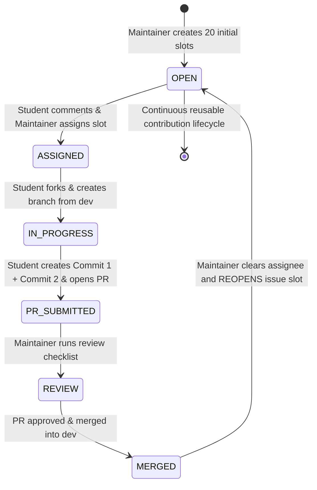

# Contribution Lifecycle & Reusable Issue Pool Architecture

## 1. The Reusable Contribution Slot Architecture

To support 200–300 student contributors without creating hundreds of one-time issues or cluttering the issue tracker, **Growing Worlds maintains a pool of approximately 20 active contribution slots**.

An issue represents an **active contribution slot in a specific world segment**, not a permanently unique item. When a student completes a contribution, the issue is merged and then **reopened** for the next student to add another item to that world segment.



---

## 2. Documented Initial 20-Issue Slot Distribution

| Slot # | Target World | Target Segment | Status | Focus / Negative Space Guidance |
| :--- | :--- | :--- | :--- | :--- |
| **#01** | Growing Forest | `forest-01` | **Active** | Woodland flora, mushrooms, or small stones |
| **#02** | Growing Forest | `forest-01` | **Active** | Flying fauna, owls, or canopy foliage |
| **#03** | Growing Forest | `forest-02` | **Active** | Meadow flowers, grass clumps, or small critters |
| **#04** | Growing Forest | `forest-02` | **Active** | Forest path details, rocks, or sunlit trees |
| **#05** | Growing Forest | `forest-03` | **Active** | Deep moss terraces, fallen logs, or woodland shrubs |
| **#06** | Growing Universe | `universe-01` *(Planned)* | Template | Spiral galaxies, nebulae, or stardust clouds |
| **#07** | Growing Universe | `universe-01` *(Planned)* | Template | Constellations, satellites, or orbiting asteroids |
| **#08** | Growing Ocean | `ocean-01` *(Planned)* | Template | Coral formations, sea anemones, or kelp forests |
| **#09** | Growing Ocean | `ocean-01` *(Planned)* | Template | Submarines, sea turtles, or swimming fish |
| **#10** | Growing City | `city-01` *(Planned)* | Template | Brownstones, paper trams, or park lampposts |
| **#11** | Growing City | `city-01` *(Planned)* | Template | Rooftop gardens, clock towers, or paper vehicles |
| **#12** | Growing Island | `island-01` *(Planned)* | Template | Palm trees, sea shells, or volcanic rock formations |
| **#13** | Growing Island | `island-01` *(Planned)* | Template | Tropical parrots, lighthouses, or wooden canoes |
| **#14** | Growing Farm | `farm-01` *(Planned)* | Template | Wheat sheaves, paper pumpkins, or wooden fences |
| **#15** | Growing Farm | `farm-01` *(Planned)* | Template | Barnyard animals, windmills, or paper tractors |
| **#16** | Growing Campus | `campus-01` *(Planned)* | Template | Brick dorms, library stacks, or campus benches |
| **#17** | Fantasy World | `fantasy-01` *(Planned)* | Template | Floating crystal islands, rune spires, or wizard towers |
| **#18** | Growing Village | `village-01` *(Planned)* | Template | Thatched cottages, cobblestone wells, or market stalls |
| **#19** | Alien Planet | `alien-01` *(Planned)* | Template | Bioluminescent mushrooms, hover probes, or xenon spires|
| **#20** | Reserved Slot | Future Segment | Template | Reserve slot for growing world expansion |

*(Note: Slots for worlds not yet implemented are clearly designated as planned templates without inventing fake schemas).*

---

## 3. The Two-Commit Workflow Specification

Each contribution is split into two small, distinct commits:

```
┌────────────────────────────────────────────────────────┐
│  Commit 1: Add Image Asset & Object Registration       │
│  - Add SVG/PNG: public/assets/worlds/<world>/<id>.svg  │
│  - Add 1-5 lines: src/data/worlds/<world>/objects.ts   │
│  - Validate: npm test                                  │
└────────────────────────────────────────────────────────┘
                           │
                           ▼
┌────────────────────────────────────────────────────────┐
│  Commit 2: Place Object in Assigned Segment            │
│  - Add 1-5 lines: src/data/worlds/<world>/placements.ts│
│  - Specify target segmentId and coordinates x, y (0-100)│
│  - Validate: npm test && npm run lint                  │
│  - Verify visually: http://localhost:3000/dev/world-engine│
└────────────────────────────────────────────────────────┘
```

**Target LOC**: Each commit should contain a small, meaningful change (~1–10 meaningful lines of code excluding asset files, imports, and formatting).

---

## 4. Complete Maintainer Review & Reopening Checklist

When reviewing a contributor PR, maintainers verify:

- [ ] **1. Issue Claimed**: Student was assigned to the issue slot before submitting.
- [ ] **2. Target Matching**: PR targets the `dev` branch, correct world, and assigned `segmentId`.
- [ ] **3. Asset Legitimacy**: Asset is an appropriate paper-cutout style (SVG/PNG/WebP), reasonably sized, with acceptable license/permission.
- [ ] **4. Contributor Boundaries**: Only files in `public/assets/worlds/<world>/`, `objects.ts`, and `placements.ts` were modified.
- [ ] **5. Two-Commit Integrity**: Exactly two distinct commits are present (not squashed).
- [ ] **6. Schema & Relational Integrity**: `objectId` and `segmentId` match valid declared keys.
- [ ] **7. Automated Quality Gates**: `npm test`, `npm run lint`, `npm run typecheck`, and `npm run build` pass cleanly.
- [ ] **8. Visual Check**: Visually confirmed in the local browser at `/dev/world-engine`.
- [ ] **9. Contributor Attribution**: Contributor display name and Discord handle are provided in the PR description.
- [ ] **10. Merge & Reopen**:
  - Merge the PR into `dev`.
  - Remove the assignee from the issue.
  - **Reopen the issue slot** so the next student can claim it.
