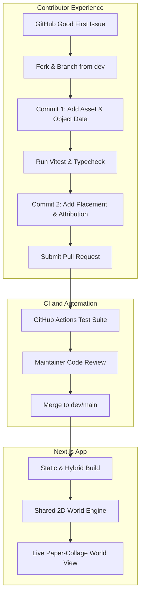
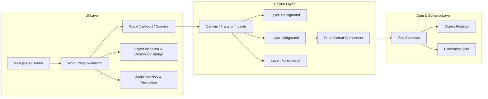

# Architecture Overview: Growing Worlds

## 1. System Vision

**Growing Worlds** is an open-source educational platform designed to teach beginners, students, and new contributors the authentic GitHub contribution lifecycle.

Instead of an abstract code repository, contributors populate living, interactive **2D Paper-Collage Worlds**. Each contribution is tiny (1–10 lines of code across two commits), representing an added object (e.g., a pine tree, a galaxy, a coral reef, a skyscraper) and its placement in a world.

---

## 2. Core Architectural Principles

### 2.1 Separation of Engine and Content
- **The Core Engine (`src/engine/`)** is maintainer-controlled, generic, and agnostic to specific world themes.
- **The World Content (`src/data/worlds/` & `public/assets/worlds/`)** is decentralized and modular. Adding a new world requires only adding a data directory and declaring its configuration.

### 2.2 Declarative Data Architecture
All world entities are strictly typed, serializable, and validated at build and test time:
1. **World Configuration (`world.config.ts`)**: Theme tokens, dimensions, layer count, background layers, music/ambient sound links.
2. **Object Definitions (`objects.ts`)**: Registry of items available in this world (ID, name, asset path, dimensions, tags).
3. **Placements Registry (`placements.ts`)**: Array of placed instances (object ID reference, x/y normalized coordinates, layer, scale, contributor details).

### 2.3 Read-Only Static/Hybrid Runtime
- There is no database or server-side mutation API.
- World states are baked directly into the repository code. When a PR merges, the static site rebuilds and reflects the new world state.

---

## 3. High-Level System Components

---

## 4. The 10 Target Paper-Collage Worlds

| World ID | Title | Theme & Palette | Key Contributor Objects |
| :--- | :--- | :--- | :--- |
| `growing-forest` | Growing Forest | Earthy greens, warm wood, sunlit mist | Pine trees, owls, mushrooms, campfires, deer |
| `growing-universe` | Growing Universe | Cosmic indigo, stardust violet, neon paper | Nebulae, spiral galaxies, satellites, asteroids |
| `growing-ocean` | Growing Ocean | Deep turquoise, coral pink, seafoam | Coral reefs, submarines, jellyfish, sea turtles |
| `growing-city` | Growing City | Blueprint blue, slate gray, warm amber | Skyscrapers, streetlights, paper trams, parks |
| `growing-island` | Growing Island | Tropical azure, sandy beige, palm green | Volcanoes, treasure chests, lighthouses, canoes |
| `growing-farm` | Growing Farm | Golden wheat, barn red, pastoral green | Windmills, tractors, pumpkins, sheep, barns |
| `growing-campus` | Growing Campus | Brick red, collegiate navy, grassy quad | Lecture halls, library stacks, bicycles, cafes |
| `fantasy-world` | Fantasy World | Mythic purple, dragon gold, enchanted emerald | Wizard towers, floating ruins, glowing crystals |
| `growing-village` | Growing Village | Cobblestone gray, thatched amber, timber brown | Cottages, water mills, market stalls, bridges |
| `alien-planet` | Alien Planet | Biome magenta, acid cyan, crater charcoal | Bioluminescent flora, hovering probes, crystal spires |

---

## 5. Architectural Boundaries Summary

- **Public Contributor Scope**:
  - `src/data/worlds/<worldId>/objects.ts`
  - `src/data/worlds/<worldId>/placements.ts`
  - `public/assets/worlds/<worldId>/*`
- **Maintainer & Engine Scope**:
  - `src/engine/*`
  - `src/schemas/*`
  - `src/components/*`
  - `tests/*`
  - `.github/*`
