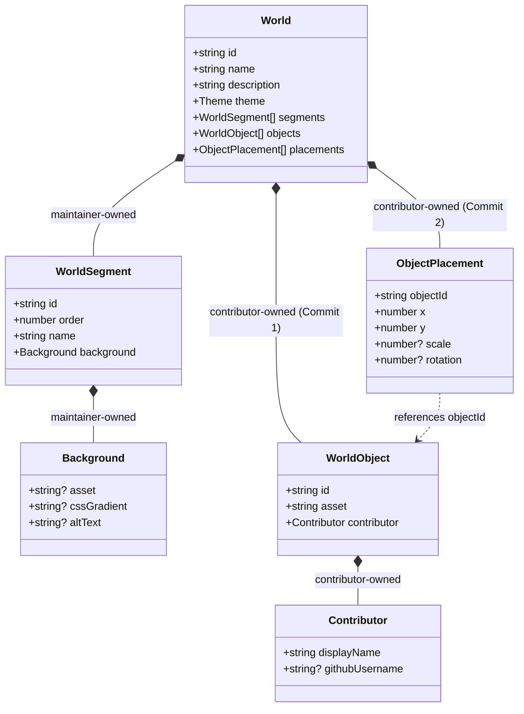

# World Data Schema & Specifications

## 1. Domain Model Overview

World data in **Growing Worlds** is completely decentralized, declarative, and type-safe. The domain model enforces a strict architectural boundary between **maintainer-owned configuration** and **contributor-owned data**.



---

## 2. Contributor vs. Maintainer Ownership

| Entity | Owner | File Location | Workflow Stage | Purpose |
| :--- | :--- | :--- | :--- | :--- |
| **`WorldObject`** | Contributor | `src/data/worlds/<world>/objects.ts` | **Commit 1** | Registers paper asset path and contributor attribution |
| **`ObjectPlacement`**| Contributor | `src/data/worlds/<world>/placements.ts` | **Commit 2** | Sets normalized `x, y` percentage coordinates (0–100) |
| **`WorldSegment`** | Maintainer | `src/data/worlds/<world>/segments.ts` | Pre-built | Multi-window growing background progression |
| **`Background`** | Maintainer | `src/data/worlds/<world>/segments.ts` | Pre-built | Static SVG/PNG backdrops or CSS gradients |
| **`World`** | Maintainer | `src/data/worlds/<world>/index.ts` | Scaffolding | Aggregates segments, objects, and placements |

---

## 3. Zod Schemas & Domain Contracts

### 3.1 Contributor Attribution (`contributor.schema.ts`)
```typescript
import { z } from "zod";

export const ContributorSchema = z.object({
  displayName: z.string().trim().min(1).max(50),
  githubUsername: z
    .string()
    .trim()
    .regex(/^[a-z\d](?:[a-z\d]|-(?=[a-z\d])){0,38}$/i)
    .optional(),
});
```
*Note: Discord usernames are not part of the core world-rendering identity.*

---

### 3.2 Object Definition (`object.schema.ts` — Commit 1)
Target implementation size: ~1–5 lines of code.
```typescript
import { z } from "zod";
import { ContributorSchema } from "./contributor.schema";

export const WorldObjectSchema = z.object({
  id: z.string().trim().regex(/^[a-z0-9]+(?:-[a-z0-9]+)*$/),
  asset: z
    .string()
    .trim()
    .regex(/^\/assets\/worlds\/[a-z0-9-]+(?:\/[a-z0-9-_]+)*\.(svg|png|webp)$/i),
  contributor: ContributorSchema,
});
```

#### Example `objects.ts` entry:
```typescript
{
  id: "demo-pine-tree",
  asset: "/assets/worlds/growing-forest/demo-pine-tree.svg",
  contributor: {
    displayName: "Shen",
    githubUsername: "ShenSandaru",
  },
}
```

---

### 3.3 Object Placement (`placement.schema.ts` — Commit 2)
Target implementation size: ~1–5 lines of code.
```typescript
import { z } from "zod";

export const ObjectPlacementSchema = z.object({
  objectId: z.string().trim().regex(/^[a-z0-9]+(?:-[a-z0-9]+)*$/),
  x: z.number().min(0).max(100), // Normalized % (0 to 100)
  y: z.number().min(0).max(100), // Normalized % (0 to 100)
  scale: z.number().min(0.1).max(5.0).optional(),
  rotation: z.number().min(-360).max(360).optional(),
});
```

#### Example `placements.ts` entry:
```typescript
{
  objectId: "demo-pine-tree",
  x: 45.0,
  y: 72.5,
  scale: 1.2,
  rotation: -2,
}
```

---

### 3.4 World & Segments (`world.schema.ts`, `segment.schema.ts`)
```typescript
export const WorldSchema = z
  .object({
    id: z.string().trim().regex(/^[a-z0-9]+(?:-[a-z0-9]+)*$/),
    name: z.string().trim().min(1).max(60),
    description: z.string().trim().min(1).max(300),
    theme: z.object({
      primaryColor: z.string().trim().min(1),
      secondaryColor: z.string().trim().optional(),
      accentColor: z.string().trim().optional(),
    }),
    segments: z.array(WorldSegmentSchema).min(1),
    objects: z.array(WorldObjectSchema),
    placements: z.array(ObjectPlacementSchema),
  })
  .superRefine((world, ctx) => {
    // 1. Verify object IDs are unique
    // 2. Verify segment IDs are unique
    // 3. Verify every placement references an existing objectId
  });
```

---

## 4. Normalized Coordinate System

To ensure all contributed objects render responsively across mobile screens, tablets, and 4K displays:
- **`x: 0–100`**: Horizontal percentage of the world segment width.
- **`y: 0–100`**: Vertical percentage of the world segment height.
- Coordinates outside `[0.0, 100.0]` (e.g. `x: -10` or `y: 150`) are rejected by Zod runtime validation.
- Depth, layering, and z-ordering are derived automatically by the World Engine (e.g. based on vertical `y` position).

---

## 5. Two-Commit Data Contract Integrity

1. **Commit 1 State**:
   - Contributor places asset in `public/assets/worlds/<world>/` and registers definition in `src/data/worlds/<world>/objects.ts`.
   - Validated independently by `WorldObjectSchema`.
2. **Commit 2 State**:
   - Contributor places object in `src/data/worlds/<world>/placements.ts`.
   - Validated by `ObjectPlacementSchema` and super-refined by `WorldSchema` (foreign key check).
