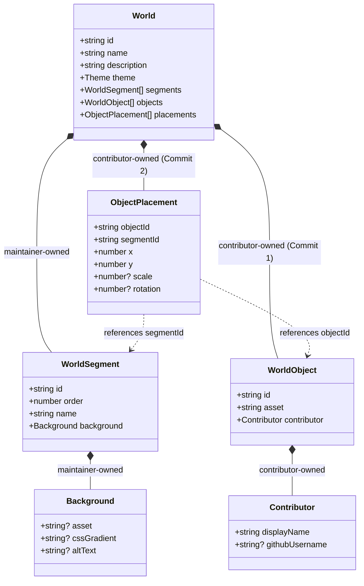

# World Data Schema & Specifications

## 1. Domain Model Overview

World data in **Growing Worlds** is completely decentralized, declarative, and type-safe. The domain model enforces a strict architectural boundary between **maintainer-owned configuration** and **contributor-owned data**.



---

## 2. Contributor vs. Maintainer Ownership

| Entity | Owner | File Location | Workflow Stage | Purpose |
| :--- | :--- | :--- | :--- | :--- |
| **`WorldObject`** | Contributor | `src/data/worlds/<world>/objects.ts` | **Commit 1** | Registers paper asset path and contributor attribution |
| **`ObjectPlacement`**| Contributor | `src/data/worlds/<world>/placements.ts` | **Commit 2** | Assigns `segmentId` and normalized `x, y` coordinates (0–100) |
| **`WorldSegment`** | Maintainer | `src/data/worlds/<world>/segments.ts` | Pre-built | Multi-window growing background progression |
| **`Background`** | Maintainer | `src/data/worlds/<world>/segments.ts` | Pre-built | Static SVG/PNG backdrops or CSS gradients |
| **`World`** | Maintainer | `src/data/worlds/<world>/index.ts` | Scaffolding | Aggregates segments, objects, and placements |

---

## 3. Zod Schemas & Domain Contracts

### 3.1 Contributor Attribution (`contributor.schema.ts`)
```typescript
import { z } from "zod";

export const ContributorSchema = z.object({
  displayName: z.string().trim().min(1).max(50),
  githubUsername: z
    .string()
    .trim()
    .regex(/^[a-z\d](?:[a-z\d]|-(?=[a-z\d])){0,38}$/i)
    .optional(),
});
```

---

### 3.2 Object Definition (`object.schema.ts` — Commit 1)
Target implementation size: ~1–5 lines of code.
```typescript
import { z } from "zod";
import { ContributorSchema } from "./contributor.schema";

export const WorldObjectSchema = z.object({
  id: z.string().trim().regex(/^[a-z0-9]+(?:-[a-z0-9]+)*$/),
  asset: z
    .string()
    .trim()
    .regex(/^\/assets\/worlds\/[a-z0-9-]+(?:\/[a-z0-9-_]+)*\.(svg|png|webp)$/i),
  contributor: ContributorSchema,
});
```

---

### 3.3 Object Placement (`placement.schema.ts` — Commit 2)
Target implementation size: ~1–5 lines of code.
```typescript
import { z } from "zod";

export const ObjectPlacementSchema = z.object({
  objectId: z.string().trim().regex(/^[a-z0-9]+(?:-[a-z0-9]+)*$/),
  segmentId: z.string().trim().regex(/^[a-z0-9]+(?:-[a-z0-9]+)*$/),
  x: z.number().min(0).max(100), // Normalized % across the segment (0 to 100)
  y: z.number().min(0).max(100), // Normalized % down the segment (0 to 100)
  scale: z.number().min(0.1).max(5.0).optional(),
  rotation: z.number().min(-360).max(360).optional(),
});
```

#### Example `placements.ts` entry:
```typescript
{
  objectId: "demo-pine-tree",
  segmentId: "forest-01",
  x: 22.0,
  y: 65.0,
  scale: 1.1,
  rotation: -1,
}
```

---

## 4. Growing World Segments & Capacity Policy

- **Segment Assignment**: Each contribution issue explicitly specifies the target world and segment (e.g. `Target segment: forest-01`).
- **No Automatic Overflow**: Automatic redistribution algorithms are intentionally avoided to ensure contributor placements remain 100% deterministic and faithfully positioned where the student intended.
- **Progressive World Growth**: As maintainers notice a segment filling up, new Good First Issues are targeted toward the next prepared segment (`forest-02`, `forest-03`, etc.).
- **Future Continuous Coordinates**: The engine can seamlessly concatenate segments `[0, 100] + [100, 200] + [200, 300]` horizontally in future phases without altering existing contributor placement files.
