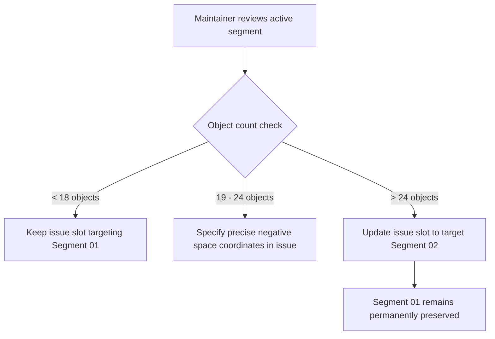

# World Density, Visual Capacity & Placement Guidelines

## 1. Why Density Matters

**Growing Worlds** presents an authentic, handcrafted 2D paper-collage world. As contributors merge pull requests, cutouts accumulate in active segments. If a single segment becomes overfilled:
1. Contributor pin labels overlap and become unreadable.
2. Foreground objects obscure background cutouts and artwork.
3. The calm, handmade paper aesthetic transforms into visual noise.

To maintain world quality without artificial automated collision or physics engines, **Growing Worlds uses maintainer-guided segment capacity rules**.

---

## 2. Visual Capacity Experiment Observations

We conducted controlled visual capacity simulations across both **Growing Forest (`forest-01`)** and **Growing Universe (`universe-01`)** testing increments of **10, 20, 30, and 40 objects**:

```
        ┌──────────────────────────────────────────────────────────┐
        │  10 Objects: Spacious & Calm (Ideal for initial launch)  │
        │  20 Objects: Rich, vibrant, balanced negative space       │
        │  30 Objects: Dense — Labels begin to overlap vertically  │
        │  40 Objects: Overcrowded — Obscures backdrop & labels    │
        └──────────────────────────────────────────────────────────┘
```

### 2.1 Growing Forest Observations
- **Terrace Ground Plane**: Forest objects (trees, flowers, deer, rocks) primarily populate the lower terrain ($y: 50\% - 88\%$).
- **Optimal Range**: **12 to 18 objects** per segment feels balanced, lush, and leaves ample sky and river negative space.
- **Density Threshold**: At **22+ objects**, trees and labels clustered near the same horizontal tier begin overlapping.

### 2.2 Growing Universe Observations
- **Full Canvas Space**: Space objects (planets, satellites, comets, moons) naturally float across the entire canvas ($y: 15\% - 85\%$).
- **Optimal Range**: **16 to 24 objects** per segment feels like a vibrant, expansive starlit cosmos.
- **Density Threshold**: At **28+ objects**, celestial bodies crowd out orbital ribbons and background nebulae.

---

## 3. Standardized Segment Capacity Thresholds

| World Type | 🌿 Comfortable (Active Intake) | ⚠️ Dense (Near Capacity) | 🛑 Full (Transition to Next Segment) |
| :--- | :--- | :--- | :--- |
| **Growing Forest** | $1 - 18$ objects | $19 - 24$ objects | **$> 24$ objects** |
| **Growing Universe**| $1 - 24$ objects | $25 - 30$ objects | **$> 30$ objects** |
| **General Worlds** | $1 - 20$ objects | $21 - 26$ objects | **$> 26$ objects** |

---

## 4. Maintainer Transition Workflow

Maintainers manage capacity through the revolving **20 Good First Issue slots**:



1. **Step 1: Check Current Segment**: Maintainer inspects `/worlds/<worldId>`.
2. **Step 2: Guide Placements in Issue Description**:
   - For a young segment: Broad creative freedom (e.g. `x: 10–90, y: 30–85`).
   - For a maturing segment: Specific negative space guidance (e.g. `upper left clearing x: 15–30, y: 40–55`).
3. **Step 3: Advance Target Segment**: Once a segment reaches the *Full* threshold ($>24$ objects in Forest), maintainers simply update the issue slot template to specify the next segment (e.g. `forest-02: Sunlit Meadow`).

---

## 5. Why Automatic Redistribution is Prohibited

Growing Worlds strictly avoids automatic coordinate shifts, collision algorithms, or live physics engines because:
- **Contributor Authorship**: A contributor chose their exact coordinates $(x, y)$ in Commit 2. Automatically shifting their object violates their creative ownership.
- **Deterministic Presentation**: The web client is static and read-only.
- **Predictable History**: The world's evolution is preserved authentically in Git history.
